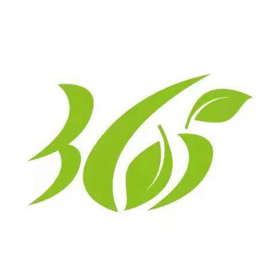

# 365生活服务平台


## 项目简介

本项目是365家政的后台管理系统。为客户端项目提供后台支持，同时满足公司日常的业务需求。[项目入口](https://manage.sy365.cn)
## 权限管理
权限模块的设计基于RBAC（Role-Based Access Control，基于角色的访问控制）

## 个人中心
## 服务人员运营
## 客户运营
## 


``` bash
# install dependencies
npm install

# serve with hot reload at localhost:8080
npm run dev

# build for production with minification
npm run build

# build for production and view the bundle analyzer report
npm run build --report
```

For a detailed explanation on how things work, check out the [guide](http://vuejs-templates.github.io/webpack/) and [docs for vue-loader](http://vuejs.github.io/vue-loader).
